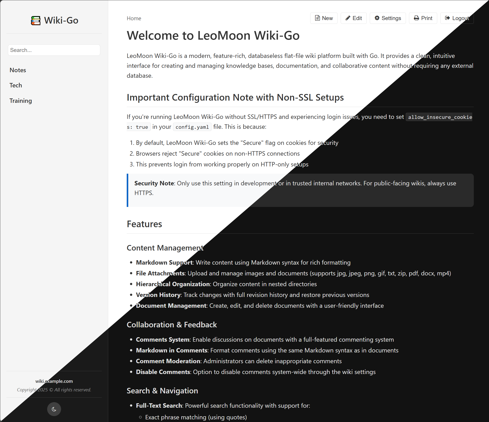

# LeoMoon Wiki-Go


[](https://github.com/leomoon-studios/wiki-go/releases)
[](https://wikigo.leomoon.com)



LeoMoon Wiki-Go is a modern, feature-rich, databaseless **flat-file wiki** platform built with Go. It provides a clean, intuitive interface for creating and managing knowledge bases, documentation, and collaborative content without requiring any external database.

No database. No bloat. Zero maintenance. Just Markdown.

## Important Configuration Note with Non-SSL Setups

If you're running Wiki-Go without SSL/HTTPS and experiencing login issues, you need to set `allow_insecure_cookies: true` in your `config.yaml` file and restart Wiki-Go. This is because:

1. By default, Wiki-Go sets the "Secure" flag on cookies for security
2. Browsers reject "Secure" cookies on non-HTTPS connections
3. This prevents login from working properly on HTTP-only setups

> **Security Note**: Only use this setting in development or in trusted internal networks. For public-facing wikis, always use HTTPS.

## Features

### Features at a Glance

- ✍️ Full Markdown editing with emoji, Mermaid diagrams, and LaTeX math
- 🔍 Smart full-text search with highlighting and advanced filters
- 📁 Hierarchical page structure with version history
- 👥 User management, access control, and private wiki mode
- 💬 Comments with moderation and markdown support
- ⚡ Instant setup via Docker or prebuilt binaries
- 🧩 Custom logos, banners, shortcodes, and more

> Perfect for internal documentation, personal knowledge bases, or team wikis.

### Content Management
- **Markdown Support**: Write content using Markdown syntax for rich formatting
- **Emoji Shortcodes**: Use emoji shortcodes like `:smile:` in your Markdown content
- **File Attachments**: Upload and manage images and documents (supports jpg, jpeg, png, gif, svg, txt, log, csv, zip, pdf, docx, xlsx, pptx, mp4)
- **Hierarchical Organization**: Organize content in nested directories
- **Version History**: Track changes with full revision history and restore previous versions
- **Document Management**: Create, edit, and delete documents with a user-friendly interface
- **Document Sorting and Naming**: Control the order of documents in the sidebar through slug names:
  - Documents are sorted alphabetically by their directory slug name
  - Document titles (displayed in the sidebar and heading) are taken from the first H1 heading in document.md
  - To manually sort documents, prefix slug names with numbers (e.g., `1-overview`, `2-installation`, `3-usage`)
  - The slug name can differ from the displayed title, allowing for organized structure while maintaining readable titles
  - Example: A directory named `1-getting-started` with document.md containing `# Getting Started Guide` will show as "Getting Started Guide" in the sidebar but be sorted first

### Collaboration & Feedback
- **Comments System**: Enable discussions on documents with a full-featured commenting system
- **Markdown in Comments**: Format comments using the same Markdown syntax as in documents
- **Comment Moderation**: Administrators can delete inappropriate comments
- **Disable Comments**: Option to disable comments system-wide through the wiki settings

### Search & Navigation
- **Full-Text Search**: Powerful search functionality with support for:
  - Exact phrase matching (using quotes)
  - Inclusion/exclusion of terms
  - Highlighted search results
- **Breadcrumb Navigation**: Clear path visualization for easy navigation
- **Sidebar Navigation**: Quick access to document hierarchy

### User Experience
- **Responsive Design**: Works on desktop and mobile devices
- **Dark/Light Theme**: Toggle between dark and light modes
- **Code Syntax Highlighting**: Support for multiple programming languages
- **Math Rendering**: LaTeX math formula support via MathJax
- **Diagrams**: Mermaid diagram integration for creating flowcharts, sequence diagrams, etc.

### Administration
- **User Management**: Create and manage users with different permission levels
- **Admin Panel**: Configure wiki settings through a web interface
- **Statistics**: Track document metrics and site usage

### Advanced Features
- **Custom Shortcodes**: Extend markdown with special shortcodes like `:::stats recenter=5:::` for additional functionality
- **Media Embedding**: Embed images, videos, and other media in your documents
- **Print Friendly**: Optimized printing support for documentation
- **API Access**: RESTful API for programmatic access to wiki content

## Demo Site

You can try out Wiki-Go using the live demo below. The demo site resets **every hour**, and all uploaded or edited content will be wiped automatically.

- 🔗 URL: https://wikigo.leomoon.com
- 👤 User: `admin`
- 🔒 Password: `demo123`

## Get Started

### Docker (quick test)

```bash
# Pull the latest image
docker pull leomoonstudios/wiki-go

# Run with default configuration
docker run -d \
  --name wiki-go \
  -p 8080:8080 \
  -v "$(pwd)/data:/wiki/data" \
  leomoonstudios/wiki-go
```

### Docker Compose

#### Option 1 – Plain HTTP (port 8080)

Use the supplied `docker-compose-http.yml`:

```bash
docker-compose -f docker-compose-http.yml up -d
```

This starts Wiki-Go on http://localhost:8080. Ideal when you terminate TLS at a reverse-proxy (Nginx/Traefik/Caddy). Remember to set `allow_insecure_cookies: true` in `data/config.yaml` if the proxy–>container hop is plain HTTP.

<details>
<summary>Nginx reverse-proxy configuration (click to expand)</summary>

```nginx
server {
    listen 80;
    server_name wiki.example.com;

    # Redirect all HTTP to HTTPS (assuming you use Let's Encrypt on 443)
    return 301 https://$host$request_uri;
}

server {
    listen 443 ssl http2;
    server_name wiki.example.com;

    ssl_certificate     /etc/letsencrypt/live/wiki.example.com/fullchain.pem;
    ssl_certificate_key /etc/letsencrypt/live/wiki.example.com/privkey.pem;

    # --- proxy to Wiki-Go container running on HTTP (port 8080) ---
    location / {
        proxy_pass http://wiki-go:8080;

        # Recommended headers
        proxy_set_header Host $host;
        proxy_set_header X-Real-IP $remote_addr;
        proxy_set_header X-Forwarded-For $proxy_add_x_forwarded_for;
        proxy_set_header X-Forwarded-Proto https;
    }
}
```

Compose example for the Nginx service:

```yaml
  nginx:
    image: nginx:alpine
    container_name: wiki-nginx
    ports:
      - "80:80"
      - "443:443"
    volumes:
      - ./nginx.conf:/etc/nginx/conf.d/default.conf:ro
      - /etc/letsencrypt:/etc/letsencrypt:ro
    depends_on:
      - wiki-go
```

</details>

#### Option 2 – Native HTTPS (port 443)

```bash
# Place certificate + key in ./ssl/
mkdir -p ssl
docker-compose -f docker-compose-ssl.yml up -d
```

`docker-compose-ssl.yml` maps host port 443 → container port 443 and mounts your certificate/key. Enable TLS in the application config (see below).

---

## Native TLS Configuration

In `data/config.yaml` set:

```yaml
server:
  host: 0.0.0.0
  port: 443            # container listens on 443
  allow_insecure_cookies: false
  ssl: true            # enable built-in HTTPS
  ssl_cert: /path/to/certificate.crt
  ssl_key:  /path/to/private.key
```

If `ssl: false` (default) the app serves plain HTTP on `port` (8080 by default) and you can run it behind a reverse proxy instead.

The Docker image published by GitHub exposes **both** 8080 and 443 so you can choose either scenario at runtime.

---

### Binary

Download the latest release for your platform from the [GitHub Releases](https://github.com/leomoon-studios/wiki-go/releases) page.
```bash
# Run the application
./wiki-go  # or wiki-go.exe on Windows
```

### Build from Source

Requirements:
- Go 1.21 or later
- Git

```bash
# Clone the repository
git clone https://github.com/leomoon-studios/wiki-go.git
cd wiki-go

# Build the binary
go build -o wiki-go

# Run the application
./wiki-go  # or wiki-go.exe on Windows
```

## Configuration

### Basic Settings

Configuration is stored in `data/config.yaml` and will be created automatically on first run with default values. You can modify this file to customize your wiki:

```yaml
server:
    host: 0.0.0.0
    port: 8080
    # When set to true, allows cookies to be sent over non-HTTPS connections.
    # WARNING: Only enable this in trusted environments like a homelab
    # where HTTPS is not available. This reduces security by allowing
    # cookies to be transmitted in plain text.
    allow_insecure_cookies: true
    # Enable native TLS. When true, application will run over HTTPS using the
    # supplied certificate and key paths.
    ssl: false
    ssl_cert:
    ssl_key:
wiki:
    root_dir: data
    documents_dir: documents
    title: "📚 Wiki-Go"
    owner: wiki.example.com
    notice: Copyright 2025 © All rights reserved.
    timezone: America/Vancouver
    private: false
    disable_comments: false
    max_versions: 10
    # Maximum file upload size in MB
    max_upload_size: 10
    # Default language for the wiki interface (en, es, etc.)
    language: en
security:
    login_ban:
        # Enable protection against brute force login attacks
        enabled: true
        # Number of failed attempts before triggering a ban
        max_failures: 3
        # Time window in seconds for counting failures
        window_seconds: 30
        # Duration in seconds for the first ban
        initial_ban_seconds: 60
        # Maximum ban duration in seconds (24 hours)
        max_ban_seconds: 86400
users:
    - username: admin
      password: <bcrypt-hashed-password>
      is_admin: true
```

### Customization

#### Custom Favicon

LeoMoon Wiki-Go comes with default favicons, but you can easily replace them with your own:

1. To use custom favicons, place your files in the `data/static/` directory with the following names:
   - `favicon.ico` - Standard favicon format (used by older browsers)
   - `favicon.png` - PNG format favicon
   - `favicon.svg` - SVG format favicon (recommended for best quality at all sizes)

2. The application will automatically detect and use your custom favicon files without requiring a restart.

SVG format is recommended for favicons as it scales well to different sizes while maintaining crisp quality.

#### Custom Logo (Optional)

You can add a custom logo to display in the sidebar above your wiki title:

1. Create a logo file in one of the supported formats:
   - `logo.svg` - SVG format (recommended for best quality)
   - `logo.png` - PNG format (alternative option)

2. Place the logo file in the `data/static/` directory.

3. The logo will automatically appear in the sidebar above your wiki title.

**Notes:**
- The logo is displayed at 120×120 pixels, but will maintain its aspect ratio
- SVG format is recommended for the best appearance at all screen sizes
- No configuration changes or application restart needed
- If no logo file is present, only the wiki title will be displayed
- If both logo.svg and logo.png exist, logo.svg will be used

#### Global Banner (Optional)

You can add a banner image that will appear at the top of all documents:

1. Create a banner image in one of the supported formats:
   - `banner.png` - PNG format (recommended for best quality)
   - `banner.jpg` - JPG format (alternative option)

2. Place the banner file in the `data/static/` directory.

3. The banner will automatically appear at the top of all document content.

**Notes:**
- The banner is displayed with responsive width and a maximum height of 250px
- The banner maintains its aspect ratio while fitting different screen sizes
- No configuration changes or application restart needed
- To remove the banner, simply delete the file from the `data/static/` directory
- If both banner.png and banner.jpg exist, banner.png will be used

### User Management

LeoMoon Wiki-Go includes a user management system with different permission levels:

- **Admin users**: Can create, edit, and delete content, manage users, and change settings
- **Regular users**: Can view content (when in private mode)

The default admin credentials are:
- Username: `admin`
- Password: `admin`

It's recommended to change these credentials immediately after first login.

## Security

- **Authentication**: User authentication with secure password hashing
- **Login Rate Limiting**: Protection against brute force attacks with temporary IP bans after multiple failed attempts
- **Private Mode**: Optional private wiki mode requiring login
- **Admin Controls**: Separate admin privileges for content management

## Usage

### Creating Content

1. Log in with admin credentials
2. Use the "New" button to create a new document
3. Write content using Markdown syntax
4. Save your document

### Organizing Content

LeoMoon Wiki-Go allows you to organize content in a hierarchical structure:

1. Create directories to group related documents
2. Use the move/rename feature to reorganize content when in edit mode
3. Navigate through your content using the sidebar or breadcrumbs

### Attaching Files

You can attach files to any document:

1. Navigate to the document and enter edit mode
2. Click the "Attachments"
3. Upload files using the upload button
4. Use "Files" tab to insert links to files in your document

### Using Comments

The commenting system allows users to provide feedback and engage in discussions:

1. Navigate to any document
2. Scroll to the comments section at the bottom
3. Authenticated users can add comments using Markdown syntax
4. Administrators can delete any comments
5. Comments can be disabled system-wide through the admin settings panel

## Technical Details

### Built With
- **Backend**: Go (Golang)
- **Frontend**: HTML, CSS, JavaScript
- **Editor**: [CodeMirror5](https://github.com/codemirror/codemirror5) for Markdown editing
- **Syntax Highlighting**: [Prism.js](https://github.com/PrismJS/prism)
- **Diagrams**: [Mermaid.js](https://github.com/mermaid-js/mermaid)
- **Math Rendering**: [MathJax](https://github.com/mathjax/MathJax)

### Architecture
- **Simple Configuration**: Easy YAML-based configuration
- **File-Based Storage**: Documents stored as Markdown files
- **Lightweight & Fast**: Built for performance
- **No External Database**: Self-contained with file-based storage

### Folder Structure

Wiki-Go uses a simple flat-file structure to store all content:

```
data/
├── config.yaml                   # Main configuration file for Wiki-Go
├── documents/                    # Regular wiki documents
│   └── path/
│       └── to/
│           └── doc-name/         # Document directory named "doc-name"
│               └── document.md   # The actual markdown content for "doc-name"
│
├── versions/                     # Version history storage
│    ├── documents/               # Regular document versions
│    │   └── path/
│    │       └── to/
│    │           └── doc-name/    # Timestamped version backup
│    │               └── YYYYMMDDhhmmss.md
│    └── pages/                   # Special pages versions
│        └── home/                # Timestamped homepage backup
│            └── YYYYMMDDhhmmss.md
│
├── pages/                        # Special pages (system pages)
│   └── home/                     # Homepage (landing page)
│       └── document.md           # Homepage content
│
├── comments/                     # Document comments
│   └── path/
│       └── to/
│           └── doc-name/         # Timestamped comments for "doc-name"
│               └── YYYYMMDDhhmmss_[user].md
│
└── static/                       # Static assets and customization
    ├── banner.png                # Global banner on all pages (optional, preferred)
    ├── banner.jpg                # Global banner on all pages (optional)
    ├── favicon.ico               # Standard favicon (optional)
    ├── favicon.svg               # SVG format favicon (optional, preferred)
    ├── favicon.png               # PNG format favicon (optional)
    └── langs/                    # Translation files copied by wiki-go at startup
```

The flat-file structure makes it easy to back up, version control, or manipulate wiki content outside the application if needed. All content is stored as plain Markdown files, and version history follows a simple timestamped file naming convention. File attachments are stored alongside the document.md file in the same directory, making it straightforward to manage document content and its associated files together.

---

LeoMoon Wiki-Go is designed to be simple to deploy and use while providing powerful features for knowledge management. It's perfect for team documentation, personal knowledge bases, and collaborative projects.